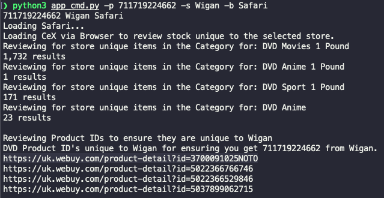

# Cex Unique Stock Finder

Python based script to find unique DVD's from a store which you would like to buy a game from that are not available at other stores who stock that game.

This is a trick to ensure the items are sent from that store in one package vs from multiple stores.

You would use this if you know the condition of a specific item in a specfic store is of the standard you're wanting, to help enforce the CEX system to deliver from that store.


Product ID and Store Name are required for both the command line and GUI version.

## Example run

The script needs [Python3](https://www.python.org/downloads/) installed before running.

The following packages need to be installed if on a fresh setup;
```pwsh
python3 -m venv myenv 
source myenv/bin/activate #on MacOS
myenv\Scripts\activate #on Windows
pip install requests
pip install numpy
pip install bs4
pip install selenium
```


The Powershell script has three parameters;

|  Parameter | Mandatory  |  Example | Notes  |   
|---|---|---|---|
|  productid (p) |  Y | 711719224662 | The item number of the product you want from the CEX website |   
|  storename (s) | Y  | Wigan  | The store name where you want the item to come from  |   
|  browser (b) | Y  | safari  | Your web browser of choice to do the scan |   

### Example command line run
```pwsh
python3 app_cmd.py -p 711719224662 -s Wigan -b Safari
```
This is looking for item **Last of Us, The: Ellie Ed. w/Canvas Wrap, Artbook & Comic (No DLC)** in the **Wigan** store. The Product ID is pulled from the URL of the item on the CEX site; https://uk.webuy.com/product-detail?id=711719224662

The script will load a new browser window and scan the site for appropriate items to buy with your wanted product.

The output will show a list of items unique to that store;



Order one of these items along with your wanted product on the same order and it should force the CEX system to dispatch from the chosen store.

